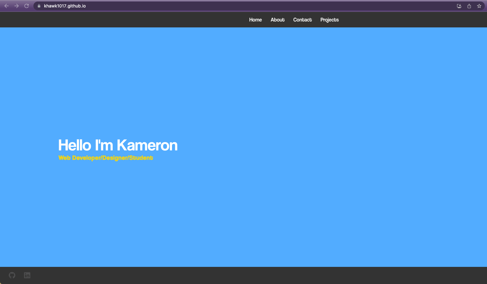

# 📁 React Portfolio 💻

## Link 🔗
visit the site here: [https://khawk1017.github.io/ ](https://khawk1017.github.io/React-portfoliov2/)

## Description 🖋️

This is my portfolio built using the React framework

## Features ✨
- **Project Showcase**: The portfolio showcases my projects, providing details about each project, including descriptions, technologies used, and live demo links. This allows visitors to get a comprehensive overview of my work.

- **About Me**: The portfolio includes an "About Me" section where I can introduce myself, share my professional journey, and highlight my expertise. This section helps visitors understand my background and interests.

- **Skills**: A dedicated section displays my skills and proficiencies, showcasing the technologies and tools I am proficient in. This provides visitors with insights into my technical abilities.

- **Contact**: The portfolio provides various ways for visitors to get in touch with me. It includes contact information such as email, phone number, and links to my social media profiles. This enables potential clients or collaborators to reach out easily.

- **Responsive Design**: The portfolio is designed to be responsive and optimized for various screen sizes. Whether accessed from a desktop, tablet, or mobile device, the portfolio offers a seamless browsing experience.

## Screenshot 📸

## Contributing 🤝
Contributions are welcome! If you find any issues or have suggestions for improvements, please feel free to open an issue or submit a pull request. Let's make this portfolio even better together!

## License 📄
This project is licensed under the MIT License. 
